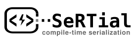

<div align="center">
  
</div>

# SeRTial

**Serialization for Real-Time** - A high-performance, zero-allocation C++20 binary serialization library using compile-time reflection.

[](https://www.gnu.org/licenses/old-licenses/gpl-2.0.en.html)

---

## Key Features

- **Zero Allocation**: Stack-only buffers with compile-time size computation
- **Compile-Time Reflection**: Automatic struct analysis via [reflect-cpp](https://github.com/getml/reflect-cpp)
- **Bounded Containers**: `fixed_vector<T,N>`, `fixed_string<N>`, `RingBuffer<T,N>` with runtime sizes
- **Block-Based Serialization**: Optimal memory copying via `StructLayout<T>` analysis
- **Interactive Viewer**: HTML-based schema visualization tool
- **Simple API**: `serialize(obj)` / `deserialize<T>(data)` - zero boilerplate

---

## Quick Start

```cpp
#include <sertial/sertial.hpp>

struct Position {
    float x, y, z;
};

int main() {
    Position pos{1.5f, 2.5f, 3.5f};
    
    // Serialize
    auto buffer = sertial::serialize(pos);
    
    // Deserialize
    auto restored = sertial::deserialize<Position>(buffer.view());
    
    std::cout << "Position: (" << restored->x << ", " 
              << restored->y << ", " << restored->z << ")\n";
}
```

---

## Installation

### Prerequisites

- CMake 3.20+
- C++20 compiler (GCC 10+, Clang 12+, MSVC 2019+)
- [reflect-cpp](https://github.com/getml/reflect-cpp)

### Install reflect-cpp

```bash
git clone https://github.com/getml/reflect-cpp.git
cd reflect-cpp && mkdir build && cd build
cmake .. && cmake --build . && sudo cmake --install .
```

### Build SeRTial

```bash
git clone https://github.com/mattih11/SeRTial.git
cd SeRTial && mkdir build && cd build
cmake .. && cmake --build .
```

### Install System-Wide

```bash
sudo cmake --install .
```

Installs to:
- `/usr/local/include/sertial/` - Headers
- `/usr/local/bin/sertial-inspect` - CLI tool
- `/usr/local/share/sertial/` - HTML viewer

### Use in Your Project

```cmake
find_package(SeRTial REQUIRED)
target_link_libraries(your_target PRIVATE SeRTial::SeRTial)
```

---

## Documentation

### API Documentation
- **API Reference** - Auto-generated from source (run `make docs` after building)
  - Browse: `docs/api/html/index.html`
  - Requires: Doxygen

### User Guides
- **[User Guide](docs/USER_GUIDE.md)** - Getting started, API reference, common patterns
- **[Container Guide](docs/CONTAINER_GUIDE.md)** - Working with fixed_vector, fixed_string, RingBuffer
- **[Examples](docs/EXAMPLES.md)** - Comprehensive code examples
- **[Schema Viewer](docs/SCHEMA_VIEWER.md)** - Interactive visualization tool

### Developer Guides
- **[Adding Containers](docs/ADDING_CONTAINERS.md)** - Extend with custom container types
- **[Container Internals](docs/CONTAINER_INTERNALS.md)** - Implementation deep-dive

### Technical References
- **[Serialization Mechanism](docs/SERIALIZATION_MECHANISM.md)** - How block-based serialization works
- **[Reflector Architecture](docs/REFLECTOR_BASED_SCHEMA.md)** - Schema generation internals
- **[Size Calculations](docs/SIZE_CALCULATIONS.md)** - Compile-time size computation
- **[Template Patterns](docs/TEMPLATE_PATTERNS.md)** - Metaprogramming techniques

### Tools
- **[CLI Tool README](tools/sertial-inspect/README.md)** - Terminal-based schema inspection
- **[Interactive Viewer](https://mattih11.github.io/SeRTial/tools/sertial-inspect/viewer.html?schema=https://raw.githubusercontent.com/mattih11/SeRTial/main/examples/schemas/example_schemas.json)** - Live demo

---

## Containers

SeRTial provides **bounded containers** for real-time safe serialization:

| Container | Purpose | Capacity | Size |
|-----------|---------|----------|------|
| `fixed_vector<T, N>` | Dynamic list | Fixed | Variable |
| `fixed_string<N>` | Text | Fixed | Variable |
| `RingBuffer<T, N>` | Circular buffer | Fixed | Variable |
| `static_buffer<N>` | Raw bytes | Fixed | Variable |
| `std::array<T, N>` | Fixed-size array | Fixed | **Fixed** |

**See**: [Container Guide](docs/CONTAINER_GUIDE.md) for complete reference

---

## Schema Viewer

Visualize your message layouts interactively:

**Live Demo**: [https://mattih11.github.io/SeRTial/tools/sertial-inspect/viewer.html?schema=https://raw.githubusercontent.com/mattih11/SeRTial/main/examples/schemas/example_schemas.json](https://mattih11.github.io/SeRTial/tools/sertial-inspect/viewer.html?schema=https://raw.githubusercontent.com/mattih11/SeRTial/main/examples/schemas/example_schemas.json)

Generate schemas:
```bash
cd build
./schema_example my_schemas.json
# Open viewer.html with my_schemas.json
```

**See**: [Schema Viewer Guide](docs/SCHEMA_VIEWER.md) for details

---

## Project Structure

```
include/sertial/           # Public API headers
├── sertial.hpp           # Main entry point
├── containers/           # Bounded containers (fixed_vector, fixed_string, RingBuffer)
├── core/                 # Type analysis (StructLayout, traits, concepts)
├── io/                   # Serialization API (serialize/deserialize)
├── integration/          # Schema export
└── reflector/            # reflect-cpp integrations

docs/                     # Documentation
├── USER_GUIDE.md
├── CONTAINER_GUIDE.md
├── EXAMPLES.md
└── ...

examples/                 # Runnable examples
├── serialization_example.cpp
├── schema_example.cpp
└── ring_buffer_example.cpp

test/                     # Unit tests
├── test_serialization.cpp
├── test_foundation.cpp
├── test_ring_buffer.cpp
└── ...

tools/sertial-inspect/    # Visualization tools
├── main.cpp             # CLI tool
├── viewer.html          # Interactive browser viewer
└── README.md
```

---

## Examples

### With Containers

```cpp
#include <sertial/sertial.hpp>
#include <sertial/containers/fixed_vector.hpp>

struct SensorData {
    uint64_t timestamp;
    uint32_t sensor_id;
    sertial::fixed_vector<float, 100> readings;
};

SensorData data;
data.timestamp = 1234567890;
data.sensor_id = 42;
data.readings.push_back(25.5f);
data.readings.push_back(26.0f);

auto buffer = sertial::serialize(data);
// Size: 8 + 4 + 4 + 2*4 = 24 bytes (not 8 + 4 + 404!)
```

**See**: [Examples Guide](docs/EXAMPLES.md) for more patterns

---

## Current Status

**Version**: 2.0.0 (Released February 2026)

**Phase 4 Complete** (Reflector-Based Introspection):
- Reflector-based schema export (zero boilerplate)
- Interactive HTML viewer (browser-based, zero dependencies)
- C++ CLI tool (replaces Python scripts)
- All Python dependencies removed
- Unified container registration via `SerializableContainer` concept

**Phase 5 Roadmap**:
- Cross-platform serialization (endianness handling)
- Nested container support
- Additional container types
- Performance profiling tools
- ROS 2 adapter (separate repository)

---

## Contributing

Contributions welcome! Please:
1. Fork the repository
2. Create a feature branch
3. Write tests for new features
4. Ensure all tests pass (`ctest`)
5. Submit a pull request

**Development guidelines**: See [.github/copilot-instructions.md](.github/copilot-instructions.md)

---

## License

Copyright (C) 2026 Matthias Haase <mattihaae@proton.me>

This program is free software; you can redistribute it and/or modify it under the terms of the GNU General Public License as published by the Free Software Foundation; either version 2 of the License, or (at your option) any later version.

See [LICENSE](LICENSE) for full details.

---

## Author

**Matthias Haase**  
Email: mattihaae@proton.me  
GitHub: [https://github.com/mattih11](https://github.com/mattih11)

---

## Acknowledgments

- **[reflect-cpp](https://github.com/getml/reflect-cpp)** - Compile-time reflection
